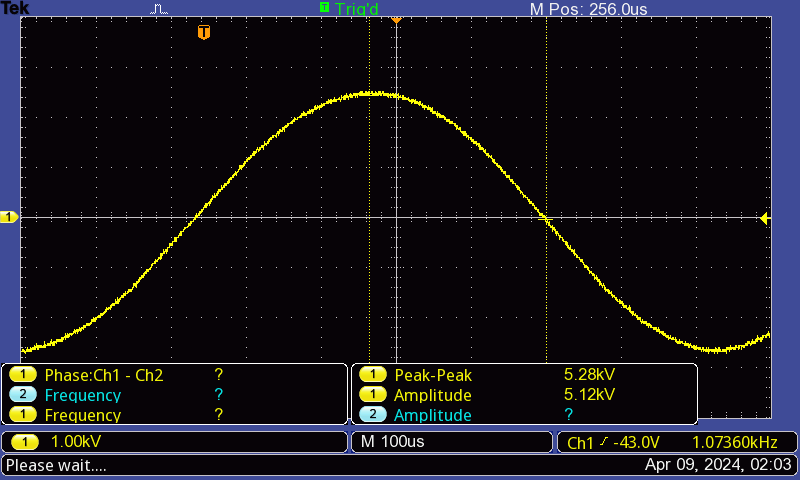

## Fourier Methods Lab

This notebook is for the 'Fourier Methods' lab for PHYS3304. 

Look at the `Methods.ipynb` for comments, methodology, and `TODO`.

Example oscilloscope signal:

Its corresponding Fourier Transform:

Some helpful links include the [Wikipedia entry for Fourier Transforms](https://en.wikipedia.org/wiki/Fourier_transform#Uncertainty_principle), the [uncertainty principle](https://en.wikipedia.org/wiki/Uncertainty_principle#Signal_processing), and the [NumPy documentation](https://numpy.org/doc/stable/reference/routines.fft.html).